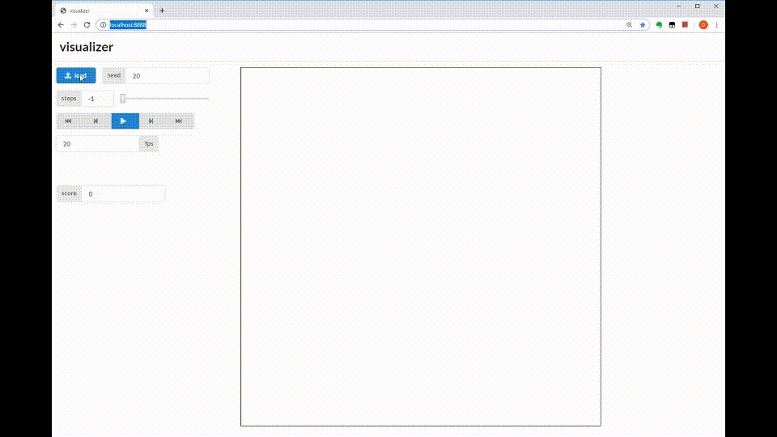

# visualizer-demo

フロントエンドのお勉強用の資料です。

### requirements


```
Python 3.6.3
Node.js v10.15.3 (npm 6.4.1)
tornado==4.5.2
numpy==1.17.0
pandas==0.25.0
```

### how to run

```
# install
npm install

# build
npm run build

# run server
python app.py

# access http://localhost:8888/
```

(開発時のインストールコマンド)
```
npm install -D webpack webpack-cli typescript typings ts-loader url-loader
npm install d3 @types/d3
npm install jquery @types/jquery
```

### demo



### license

* MIT License
* ヴィジュアライザの作りについては、https://github.com/kmyk/longcontest-visualizer-framework (MIT License) を元にしています
* 問題については、https://atcoder.jp/contests/rco-contest-2017-qual/tasks/rco_contest_2017_qual_b を参考にしています  
